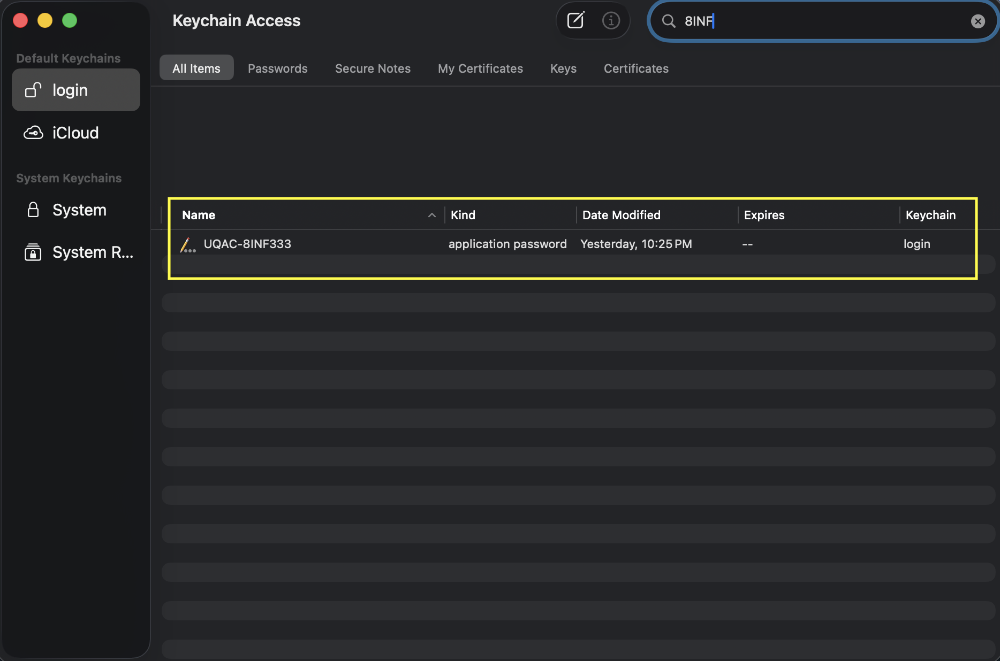
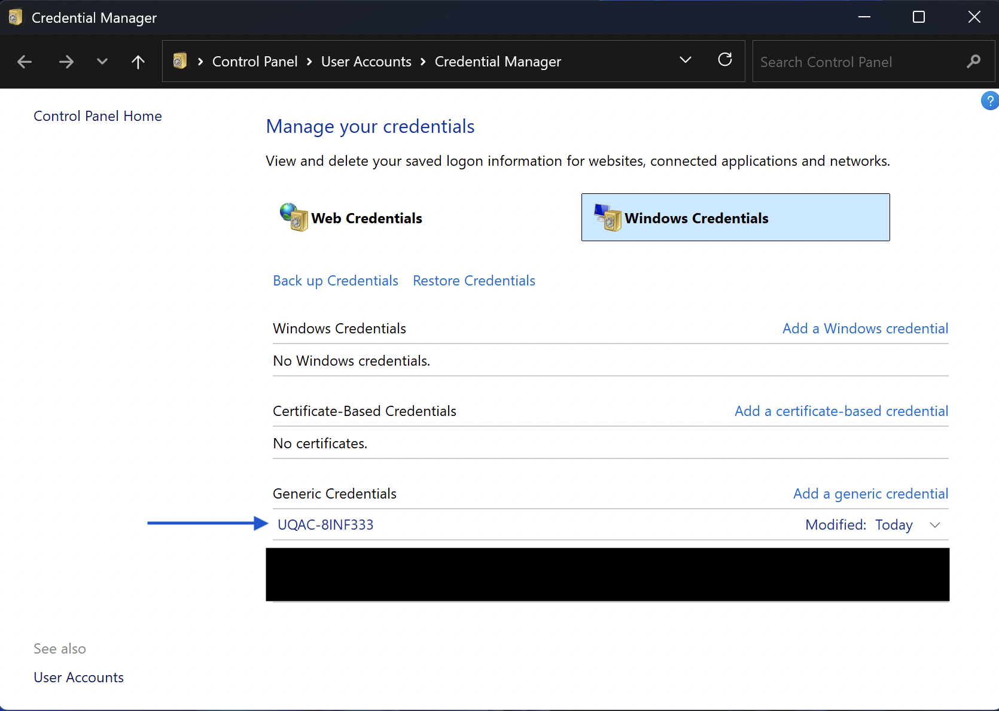

<h1>8INF333 : TP-1<br>
Gestionnaire de Fichiers Chiffrés</h1>

Au cours de ce début de session, nous avons vu plusieurs notions de cryptographie qu’il est important pour vous de comprendre. Ainsi, ce travail pratique a pour objectif de vous permettre de mettre en pratique certains éléments que nous avons vus en classe à travers un exemple concret.

## Auteurs
 - POTL15100200: Potvin, Ludovic

## Compatibilité

Python – version >= 3.8

> [!CAUTION]
> Code testé et fonctionnel sur les plateformes suivantes :
> - _```Windows 11 24H2```_
> - _```macOS 26.2 (Tahoe)```_
>
> _Voir la section [`contact`](#contact) pour tout problème de compatibilité._

## Démarrage
   1. Installer Python >= 3.8.
   2. Ouvrir une invite de commande.
   3. Se déplacer dans le dossier racine du TP :
      ```sh
         cd <your_base_path>/file_encrypt
      ```
   4. Vérifier que Python est correctement installé et que vous avez une version adéquate :
      ```sh
      # Win:
      python --version
      # Unix:
      python3 --version
      ```
      > [!WARNING]
      > Si cette commande retourne une erreur, votre installation de python n'est pas correcte !
   5. Créer un environnement virtuel :
      ```sh
      # Unix:
      python3 -m venv .venv
      # Win:
      python -m venv .venv
      ```
   6. Activer l'environnement vituel :
      ```sh
      # Unix :
      source .venv/bin/activate
      # Win :
      .\.venv\Scripts\activate
      ```
   7. Mettre à jour ```pip``` :
      ```sh
      # Unix:
      python3 -m pip install --upgrade pip
      # Win:
      python -m pip install --upgrade pip
      ```
   8. Installer les dépendances :
      ```sh
      # Unix:
      pip3 install -r requirements.txt
      # Win:
      pip install -r requirements.txt
      ```
   9. Lancer l'application :
      ```sh
      # Unix:
      python3 src/app.py
      # Win:
      python src/app.py
      ```
## Consignes

Vous pouvez travailler en équipe de **2 MAXIMUM**. N'oubliez pas de renseigner les bonnes informations pour chaque membre de l'équipe dans la section [`auteurs`](#auteurs).

Complétez les fonctions de la classe ```CryptoWorker``` dans le fichier ```services/crypto_worker.py``` en vous aidant des "docstrings" pour chacune d'elles.

> [!IMPORTANT]
> - Vous ne devez pas modifier le code hors du fichier ```services/crypto_worker.py```.
> - Vous ne pouvez pas inclure d'autres dépendances que celles déjà importées.
> - Vous ne pouvez pas changer la structure initiale des fichiers du projet.

En ce qui concerne le stockage sécurisé, celui-ci varie selon le système d'exploitation :
   - Pour **macOS**, vous allez utiliser ```Keychain``` :

   

   > [!TIP]
   > ```Keychain``` ne permet pas de supprimer une entrée lorsque la liste affiche des résultats de recherche. Vous devez passer par la liste générale et trouver vous-même l'entrée que vous voulez modifier ou supprimer. _Oui... c'est très mal codé..._

   - Pour **Windows**, vous allez utiliser le ```credential locker``` :

   

   - Pour **Linux**, il y a plusieurs options avec des dépendances supplémentaires à installer dans certains cas. Référez-vous à [la documentation](https://pypi.org/project/keyring/) de la librairie ```keyring``` ou contactez-moi si vous avez des difficultés (cf. section [`contact`](#contact)). N'oubliez pas de produire un nouveau ```requirements.txt``` si vous ajoutez une librairie requise pour Linux avec la commande : ```pip3 freeze > requirements.txt``` à l'intérieur de votre environnement virtuel.

> [!TIP]
> Vous pouvez, au besoin, vous aider d'une IA générative pour compléter le code. Cependant, **je vous demande d'être transparent dans cet usage.** Indiquez clairement dans la "docstring" des fonctions concernées, l'usage d'un tel outil et précisez lequel. Aussi, **précisez les prompts que vous avez utilisés dans la docstring de la fonction en question**. _Cela n'entraînera pas de perte de points !_
>
> Exemple:
>
> ```py
> """
> ...
> Prompt
> ------
>     <prompt_1>
>     <prompt_2>
> ...
> """
> -------


Vous devez remettre un projet fonctionnel sur [Moodle](https://moodle.uqac.ca/mod/assign/view.php?id=632110) **au plus tard le 1<sup>er</sup> mars 2026 à 23h59**. Pour ce faire, créez une archive ```zip``` du dossier racine du projet que vous **(re)nommerez : ```file_encrypt```**.

Veuillez, s’il vous plaît, **nettoyer votre dossier racine de remise** en supprimant notamment le sous-dossier ```.venv``` afin d'alléger le dépôt.

> [!IMPORTANT]
> Toute autre méthode de remise pour ce travail ne sera pas acceptée. Votre travail sera alors considéré comme non remis. De plus, tout non-respect des consignes de remise entraînera une perte de points partielle ou totale.

## Bonus

> [!NOTE]
> **Le bonus vaut 2 points supplémentaires**. Vous pouvez donc une note maximale de 12/10 pour ce travail pratique.


- Répondez à la question (_env._ 10 lignes) directement dans le fichier ```bonus.docx```.
- Générer un ```pdf``` à partir de ce fichier.
- **Ne remettez que le fichier ```pdf``` et non le ```docx```** au même emplacement afin qu'il se trouve dans l'archive ```zip``` finale à remettre sur [Moodle](https://moodle.uqac.ca/mod/assign/view.php?id=632110).

## Retard

Tout travail **remis en retard sans motif valable** sera évalué sur 50%. Une pénalité de 10% additionnels par jour supplémentaire sera appliquée après le premier jour de retard (_p. ex._ 3 jours de retard, le travail est évalué sur 30%).

## Contact
Si vous rencontrez des problèmes avec le code de base, ou pour toute question de manière générale, vous pouvez m'écrire un courriel à l'adresse : <fthullie@uqac.ca>.